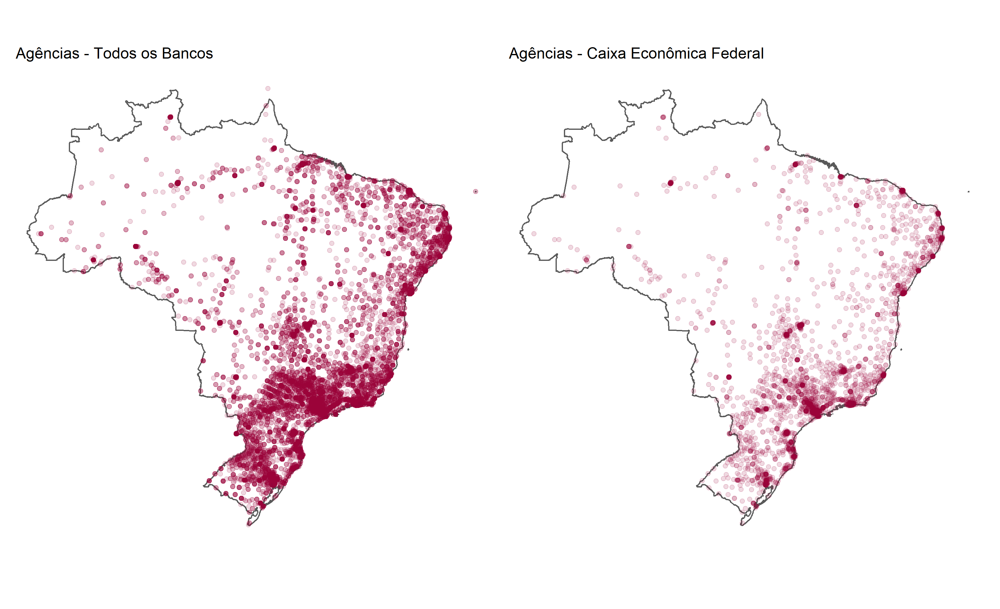
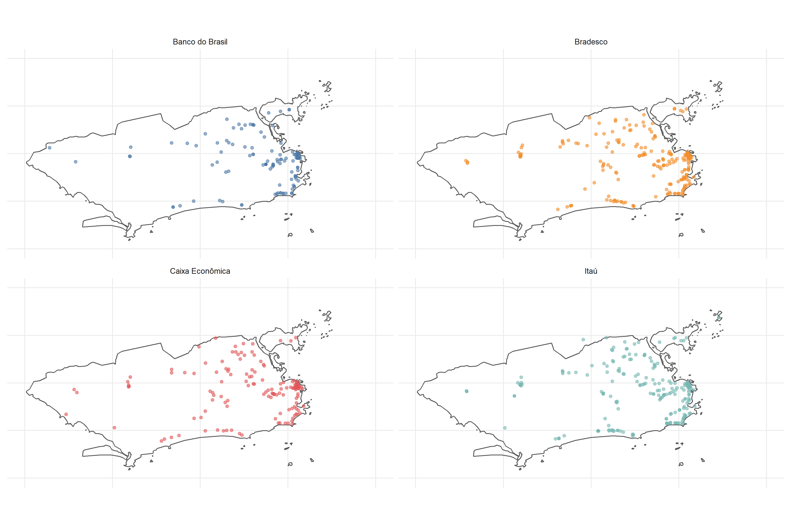
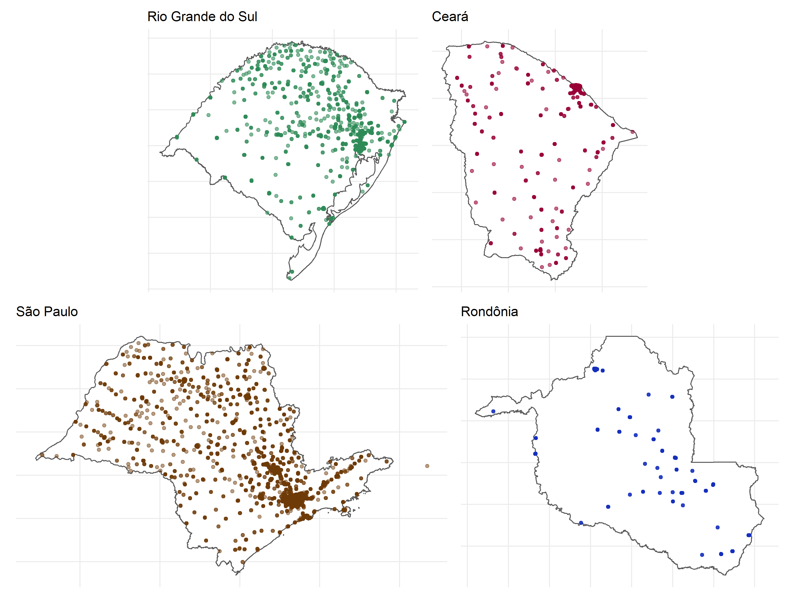

# Localização de Agências Bancárias no Brasil

O objetivo desse repositório é criar e disponibilizar publicamente uma base de dados colaborativa com a distribuição espacial das agências bancárias no Brasil. **Este é um trabalho em construção**.

Embora a digitalização bancária seja crescente no país, o acesso a agências físicas ainda é bastante importante, principalmente para a população mais pobre. Em particular, postos de atendimento da [Caixa Econômica Federal](https://www.caixa.gov.br/sustentabilidade/investimentos-socioambientais/programas-sociais/Paginas/default.aspx), onde são sacados benefícios trabalhistas (Seguro Desemprego, FGTS) e de programas sociais como o Bolsa Família, Minha Casa Minha Vida e Auxílio Emergencial. Ainda, o acesso mesmo a agências de bancos privados é importante, já que a bancarização facilita e está associada à formalização no mercado de trabalho, acesso a crédito, entre outros.

A [base da dados](https://github.com/lucaswarwar/agencias/blob/main/data/csv/agencias_set20%20-%20agencias_set20.csv) disponível nesse repositório traz, para cada agência, o nome, banco, segmento, CNPJ, código de compensação, endereço completo, município com código do IBGE, UF, telefone, um id único dado pelo BACEN e as coordenadas geográficas (latitude e longitude). Além da base de dados das agências geolocalizadas em .csv, nesse repositório estão disponíveis também as bases brutas obtidas no site do BACEN, um arquivo .shp com as mesmas informações em formato shapefile, e os scripts com os códigos em R utilizados na limpeza dos dados e geolocalização.

As informações sobre as agências utilizadas são de responsabilidade das instituições financeiras, que declaram mensalmente ao Banco Central as agências em funcionamento. Os dados brutos são obtidos no site do BACEN através desse [link](https://www.bcb.gov.br/acessoinformacao/legado?url=https:%2F%2Fwww.bcb.gov.br%2Ffis%2Finfo%2Fagencias.asp), que é atualizado todo mês.

Inicialmente, foram geolocalizadas utilizando a [Google Maps API](https://developers.google.com/maps/documentation/geocoding/overview) todas as 19.218 agências em funcionamento no mês de setembro de 2020 (dado mais recente até o momento). Após a geolocalização, agências com inconsistências foram corrigidas por meio de busca manual pela localização das mesmas. No entanto, *muito possivelmente ainda existem inconsistências*, de modo que o uso das informações da base deve levar em conta essa ressalva. Inclusive, caso encontre algum desses erros, por favor entrar em contato via lucas.warwar@gmail.com. **Esse repositório é um trabalho em construção.**

O intuito é, ao longo do tempo, criar uma base de dados colaborativa com uma série histórica da distribuição espacial das agências bancárias no país. Dado que quase 20 mil agências já foram geolocalizadas, a construção e correção dessa base - tanto em retrospectiva como no futuro - é um trabalho relativamente fácil. Com isso, espera-se fomentar a realização de análises e estudos que levem em consideração a acessibilidade a serviços bancários em dinâmicas do mercado de trabalho, vulnerabilidade social, entre outras.

# Créditos

As bases de dados originais são fornecidas pelo Banco Central do Brasil e as informações são declaradas por cada instituição financeira. Caso queira utilizar as bases geolocalizadas desse repositório, é possível citar:

- Warwar, L. (2020) **Geolocalização das agências bancárias no Brasil.** Repositório do GitHub - [https://github.com/lucaswarwar/agencias/](https://github.com/lucaswarwar/agências/)
